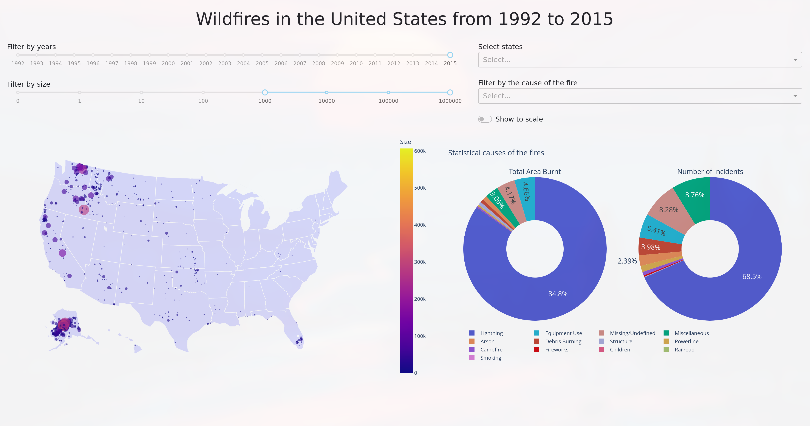

## Data

  - [1.88 Million US Wildfires](https://www.kaggle.com/rtatman/188-million-us-wildfires)
  - Large dataset containing records of wildfires in the US from 1992 to 2015.

## Preprocessing

The original dataset contains a large amount of columns and therefore was unnecessarily large
for my needs. For that reason I dropped most of the columns. Here is the head of the final table.

| LATITUDE  | LONGITUDE   | FIRE_SIZE | FIRE_YEAR | STATE | STAT_CAUSE_DESCR | FIRE_NAME |
| --------- | ----------- | --------- | --------- | ----- | ---------------- | --------- |
| 40.036    | -121.005    | 0.10      | 2005      | CA    | Miscellaneous    | FOUNTAIN  |
| 38.933    | -120.404    | 0.25      | 2004      | CA    | Lightning        | PIGEON    |
| 38.984    | -120.735    | 0.10      | 2004      | CA    | Debris Burning   | SLACK     |
| 38.559    | -119.913    | 0.10      | 2004      | CA    | Lightning        | DEER      |
| 38.559    | -119.933    | 0.10      | 2004      | CA    | Lightning        | STEVENOT  |

No other actions were necessary.

## Interactivity

The visualization contains a map of the United States with marks corresponding to each wildfire.
The user has the option to select which subset of the wildfires to show.
The displayed wildfires can be filtered based on:
  - The size of the fire (in acres)
  - The year in which the wildfire took place
  - States
  - What was the cause of the fire
There is also an option to render the marks to have the same area (relatively to the map)
as was the size of the corresponding fire.

## Interesting findings

  - The largest wildfires are almost always caused by lightning
  - The small ones are mostly debris burning and arson
  - Alaska is always on fire

The visualization is available from [here](https://xkozlov1-pv251-project.herokuapp.com/).

